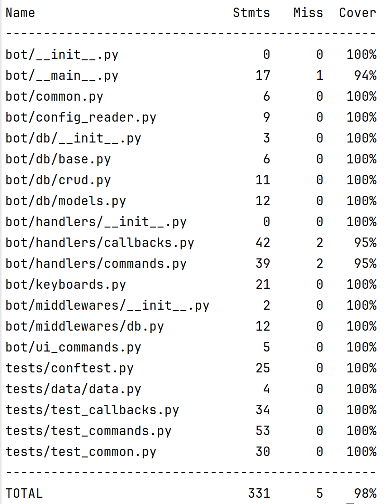

### ДЗ 3

#### Бот для годового проекта (АПИ для генерации логотипов)

_В реальном проекте бот должен смотреть на апишку генерящую логотипы, вместо нее берем логотипы из папки static_

### Запуск проекта 

1. Подставить в docker/app-variables.env -> BOT_TOKEN токен бота
2. Из корневой директории выполнить docker-compose up -d
3. В команде /generate геренация логотипа происходит после составления промпта из готовых слов, в конце необходимо нажать Go

### Запуск тестов 

1. Тесты запустятся вместе с запуском проекта
2. Можно отдельно запустить командой docker-compose up --build tests
3. Проверка flake8 запускается вместе с тестами
4. В консоли выпадет таблица с покрытием

**Удаление проекта**

1. docker-compose down
2. docker image prune --all

### Ссылка на репозиторий

https://github.com/efgraph/appy_bot

__ФИО:__ _Спиридонов Д В (специальность МОВС)_

